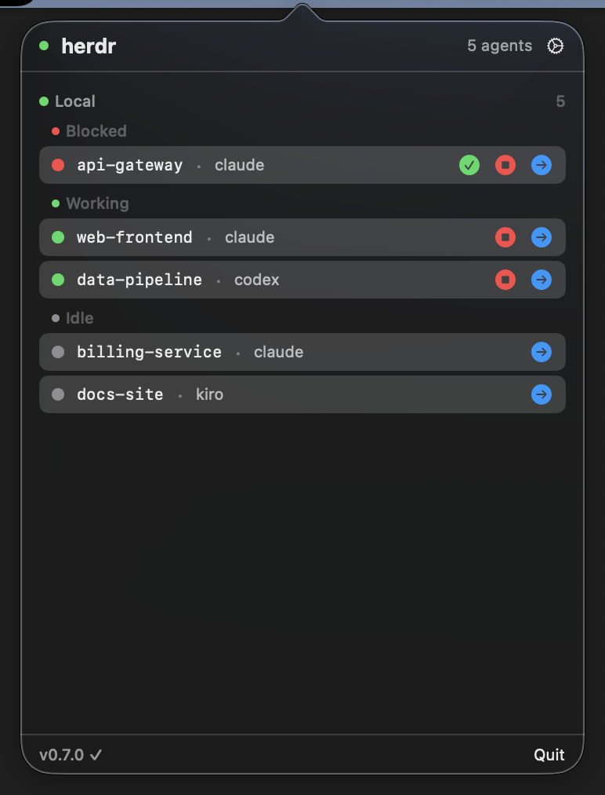
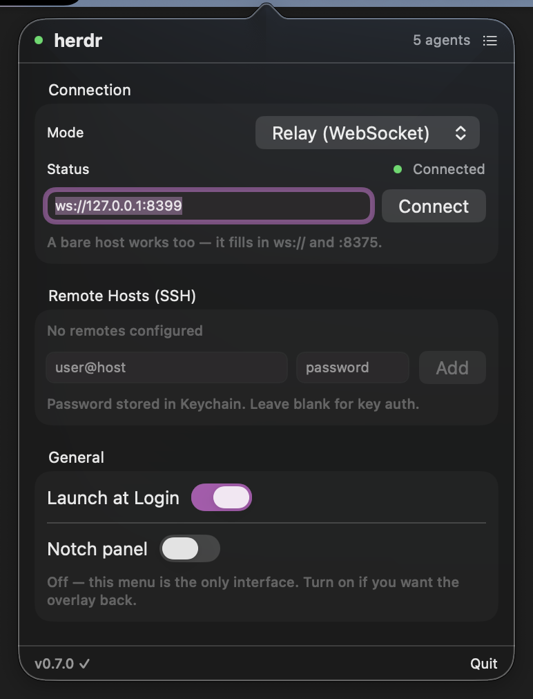

# herdr-remote

Agent dashboard for [herdr](https://herdr.dev) -- menu bar, phone, Telegram. Zero config locally, free tunnel for remote.

**[Try the live demo](https://herdr-demo.pages.dev)**

## Install (10 seconds)

Download [Herdi.app](https://github.com/dcolinmorgan/herdr-remote/releases/latest) and drag to Applications.

Monitors all your local herdr agents automatically -- no relay, no config, no account.

```bash
curl -sL https://github.com/dcolinmorgan/herdr-remote/releases/latest/download/Herdi-0.6.3.dmg -o /tmp/Herdi.dmg && open /tmp/Herdi.dmg
```

### Build it yourself

```bash
make install     # build Herdi.app and copy it into /Applications
```

`make` on its own lists every target — `make app` for just the bundle, `make dmg` for a
distributable image, `make run` to launch a build without installing, `make relay` for the relay.
The version is set once in the Makefile and passed to both build scripts, so
`make dmg VERSION=0.7.0` is all it takes to cut a differently-numbered image.

## What you get

- **Live agent timeline** -- who worked when, who blocked, who finished
- **One-tap approvals** from phone, menu bar, or Telegram
- **Daily activity digest** -- `/digest` in Telegram shows working time + block count
- **Terminal interaction** -- read output, send commands, interrupt agents remotely
- **Notifications** -- know instantly when agents need you or finish
- **11 themes** -- dark, herdr, light, sand, clay, dune, nord, rose, dracula, kanagawa, midnight

## Screenshots

| Menu Bar App | Settings |
|:--:|:--:|
|  |  |

| Agent List | Terminal View |
|:--:|:--:|
|  |  |

## Remote monitoring (phone/Telegram)

For monitoring agents across machines or from your phone:

```bash
herdr plugin install dcolinmorgan/herdr-push
cd herdr-remote/relay && ./start.sh
```

Open [herdr-demo.pages.dev](https://herdr-demo.pages.dev) on your phone, paste the tunnel URL.

### Private network only (Tailscale / LAN, no tunnel)

The relay binds `0.0.0.0` and serves the web app itself, so no tunnel is needed if the devices
already share a private network. Skip cloudflared entirely:

```bash
HERDR_TUNNEL_MODE=none uv run relay/herdr_relay.py
```

On startup it prints every address it is reachable on:

```
Reachable at: http://<tailscale-ip>:8375/  (ws://<tailscale-ip>:8375)
```

Open that `http://…:8375/` URL on any device on the tailnet — the page auto-connects back to the
relay it was served from, so there is nothing to paste into Settings.

Two things to know about running without TLS:

- **Web Push needs HTTPS.** Over plain http the browser disables service workers, so background push
  is unavailable. Live notifications still work while the tab is open. Put TLS in front of the relay
  (e.g. `tailscale serve`) if you want background push.
- **Don't paste a `ws://` URL into an `https://` page.** A page loaded from Cloudflare Pages cannot
  open a cleartext WebSocket — browsers block it as mixed content. Open the relay's own address
  instead.

### macOS: grant Herdi "Local Network" access

macOS 15+ silently blocks apps from reaching LAN and Tailscale (`100.64.0.0/10`) addresses until you
approve them, and `URLSession` reports **no error** when it does — the app just never receives
anything. If Herdi sits on "Disconnected" against a non-loopback relay, enable it under
**System Settings ▸ Privacy & Security ▸ Local Network**. Loopback (`ws://127.0.0.1:8375`) is exempt
and works without any grant.

### Notifications over ntfy (opt-in)

[ntfy](https://ntfy.sh) sidesteps the HTTPS problem entirely: the relay POSTs to an ntfy server and
your phone gets a real push notification through the ntfy app, with the tab closed and no TLS on the
relay. Web Push remains the default; ntfy is additive and off until you set a topic.

```bash
export HERDR_NTFY_TOPIC="herdr-a8f3c1b90d2e"   # the only required setting
uv run relay/herdr_relay.py
```

Subscribe to the same topic in the ntfy app. On startup the relay confirms the channel:

```
ntfy enabled: https://ntfy.sh/herdr-a8f3c1b90d2e (priority=high tags=sheep)
```

> On a public server the topic name is the only thing protecting it — anyone who knows it can read
> and publish. Use a long random topic, or self-host with auth.

Everything else is optional:

| Variable | Default | Purpose |
|----------|---------|---------|
| `HERDR_NTFY_TOPIC` | — | Topic to publish to. **Setting it enables ntfy.** |
| `HERDR_NTFY_SERVER` | `https://ntfy.sh` | Self-hosted server URL |
| `HERDR_NTFY_TOKEN` | — | Access token (`tk_…`) |
| `HERDR_NTFY_USER` / `_PASSWORD` | — | Basic auth, as an alternative to the token |
| `HERDR_NTFY_PRIORITY` | `high` | `min`, `low`, `default`, `high`, `urgent` |
| `HERDR_NTFY_TAGS` | `sheep` | Comma-separated ntfy emoji shortcodes |
| `HERDR_NTFY_TITLE_PREFIX` | — | Prepended to every title |
| `HERDR_NTFY_CLICK_BASE` | — | Web app base URL, makes notifications tappable |
| `HERDR_NTFY_NOTIFY_RESOLVED` | off | Also notify when an agent unblocks |
| `HERDR_NTFY_RESOLVED_PRIORITY` | `low` | Priority for those resolved messages |
| `HERDR_NTFY_TIMEOUT` | `5` | Seconds before giving up on the ntfy server |

A failed or slow ntfy publish is logged and ignored — it never delays polling or breaks a client.

### Wiring up push events (optional)

Polling every 2s already keeps clients current; the plugin only makes status changes instant. The
`herdr-push` plugin exits silently unless `HERDR_RELAY` is set in its config:

```bash
echo 'HERDR_RELAY=http://127.0.0.1:8375' >> ~/.config/herdr/plugins/config/herdr.push/.env
```

## Telegram Bot

Full agent interaction:

```bash
export HERDR_TG_TOKEN="your-token"
export HERDR_TG_CHAT_ID="your-chat-id"
uv run relay/herdr_telegram.py
```

| Command | Action |
|---------|--------|
| `/agents` | List all with status |
| `/read` | Read agent output |
| `/reply` | Read + respond in one flow |
| `/send` | Send text to an agent |
| `/trust` | Trust all tools for blocked agent |
| `/interrupt` | Send Ctrl+C |
| `/digest` | Today's activity summary |

## Architecture

```
                    ┌──────────────────────────────┐
                    │  macOS Menu Bar (Herdi.app)   │ <- zero config
                    └──────────────────────────────┘

┌──────────────┐  ┌──────────────┐  ┌──────────────┐
│  Web App     │  │  Telegram    │  │  TUI         │
│  (phone)     │  │  Bot         │  │  (terminal)  │
└──────┬───────┘  └──────┬───────┘  └──────┬───────┘
       │                  │                  │
       └───── WebSocket ──┴──────────────────┘
                   │
        ┌──────────┴──────────┐
        │   relay (:8375)     │  <- Cloudflare tunnel
        └──────────┬──────────┘
                   │
     ┌─────────────┼─────────────┐
     │ local poll  │ herdr-push  │
     │ (herdr CLI) │ (HTTP POST) │
     └──────┬──────┘──────┬──────┘
         ┌──┴──┐     ┌────┴────┐
         │herdr│     │herdr    │
         │local│     │remote   │
         └─────┘     └─────────┘
```

## Terminal TUI

```bash
uv run relay/herdr_tui.py
```

## Token Auth

```bash
export HERDR_RELAY_TOKEN="$(openssl rand -hex 16)"
uv run relay/herdr_relay.py
```

## Requirements

- macOS 14+ (menu bar app)
- Python 3.10+ with [uv](https://docs.astral.sh/uv/) (relay/TUI/bot)
- `cloudflared` (for remote access)
- herdr 0.7+
- Zero-dep plugin: [`herdr-push`](https://github.com/dcolinmorgan/herdr-push)

## Changelog

### v0.6.0

- **Workspace drill-down** — agents grouped by workspace/space; blocked "Needs you" agents hoisted to top of dashboard before workspace cards
- **Prettier cards** — shadcn-style: 12px radius, subtle borders, hover lift/shadow, `active:scale(0.99)`, cwd display, chevron navigation
- **Web Push (VAPID)** — subscribe in Settings; get notified when agents block even with tab closed; auto-clears when agent unblocks
- **Structured audit log** — all write actions (respond, send_text, send_keys) logged as JSONL to `~/Library/Logs/herdr-remote/audit.log`
- **Push collapse + TTL** — offline devices get only the latest notification (Topic: `herdr-herd`, TTL: 6h), not a burst of stale alerts
- **Count pills** — workspace cards show pane/tab counts at a glance

### v0.5.0

Telegram bot (`/agents /read /send /reply /trust /interrupt`), demo bot, linux setup script.
